# Ứng dụng Projesk2 - Quản lý công việc nhóm
Ứng dụng quản lý công việc nhóm giúp tăng cao hiệu suất làm việc của các thành viên
## Nội dung
1. [Chức năng](#chức-năng)
    - [Đăng nhập / Đăng ký](#đăng-nhập--đăng-ký)
    - [Quản lý các project của tôi](#quản-lý-các-project-của-tôi)
    - [Quản lý các task của tôi](#quản-lý-các-task-của-tôi)
    - [Quản lý các task trong project](#quản-lý-các-task-trong-project)
    - [Quản lý thành viên của project](#quản-lý-thành-viên-của-project)
    - [Xem hoạt động của các thành viên](#xem-hoạt-động-của-các-thành-viên)
    - [Xem thông tin chi tiết của task](#xem-thông-tin-chi-tiết-của-task)
    - [Thông tin người dùng](#thông-tin-người-dùng)
    - [Thông báo](#thông-báo)
    
2. [Yêu cầu thiết bị](#yêu-cầu-thiết-bị)
3. [Thư viện và công nghệ](#thư-viện-và-công-nghệ)
4. [Sơ đồ quan hệ](#sơ-đồ-quan-hệ)
5. [Tác giả](#tác-giả)
6. [Giấy phép](#giấy-phép)

## Chức năng
### Đăng nhập / Đăng ký
<p align="center">
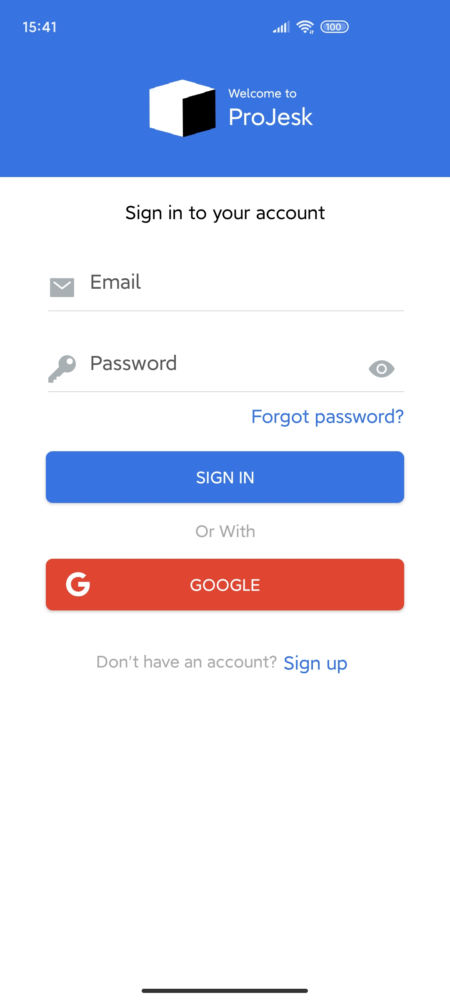 
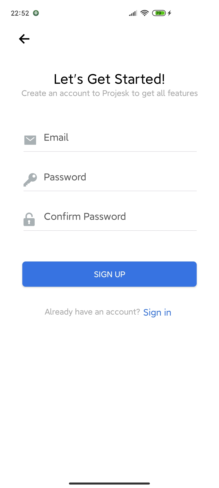 
</p>

### Quản lý các project của tôi
<p align="center">
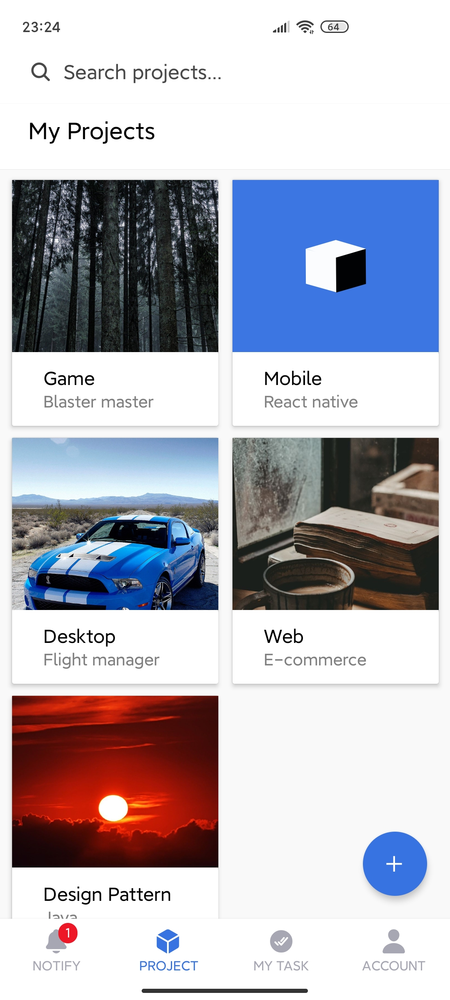
</p>

### Quản lý các task của tôi
<p align="center">
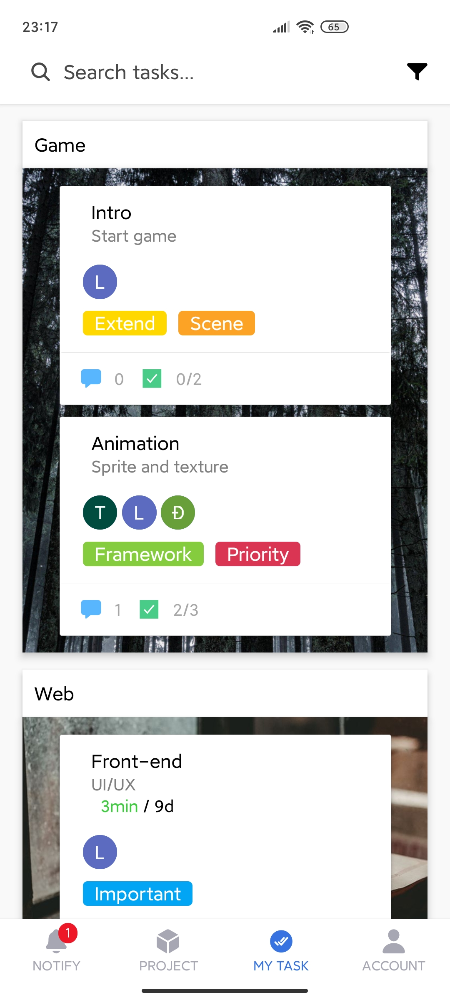 
</p>

### Quản lý các task trong project
<p align="center">
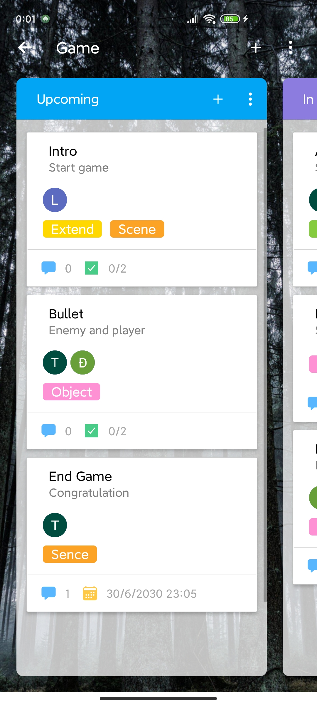 
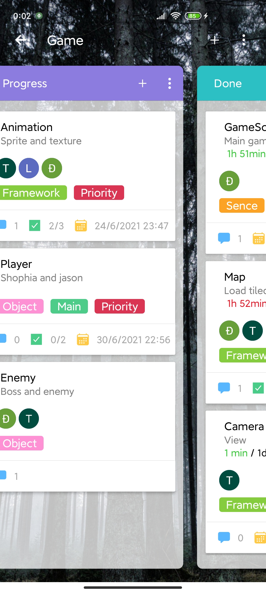 
</p>

### Quản lý thành viên của project
<p align="center">
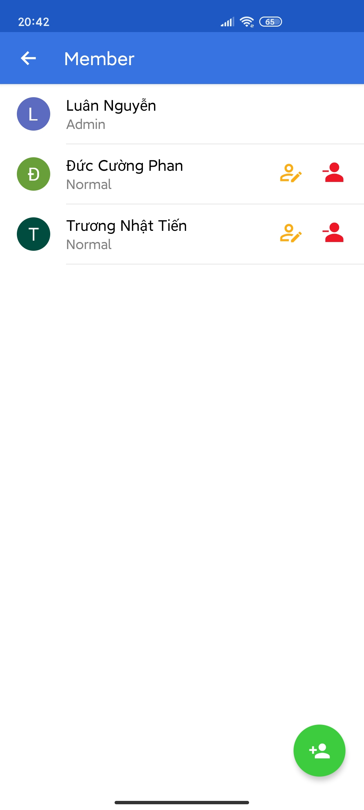
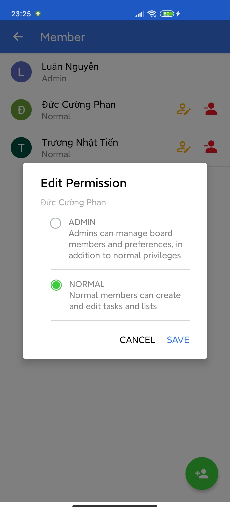
</p>

### Xem hoạt động của các thành viên
<p align="center">
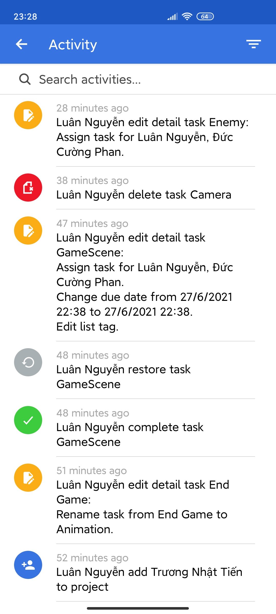
</p>

### Xem thông tin chi tiết của task
<p align="center">
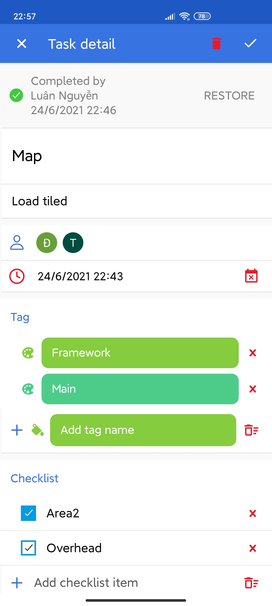 
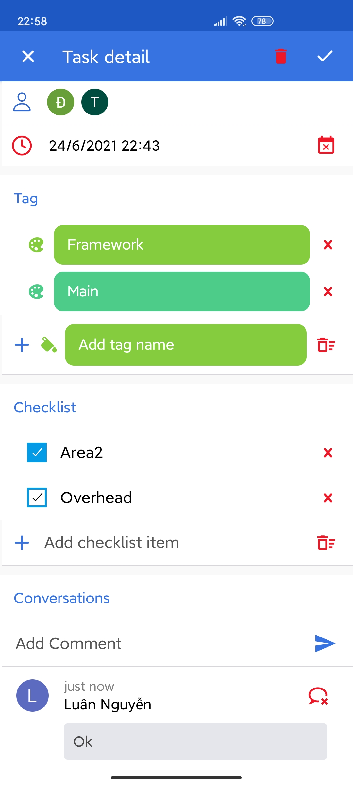 
</p>

### Thông tin người dùng
<p align="center">
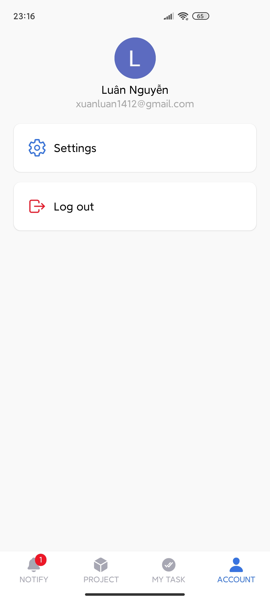 
</p>

### Thông báo 
<p align="center">
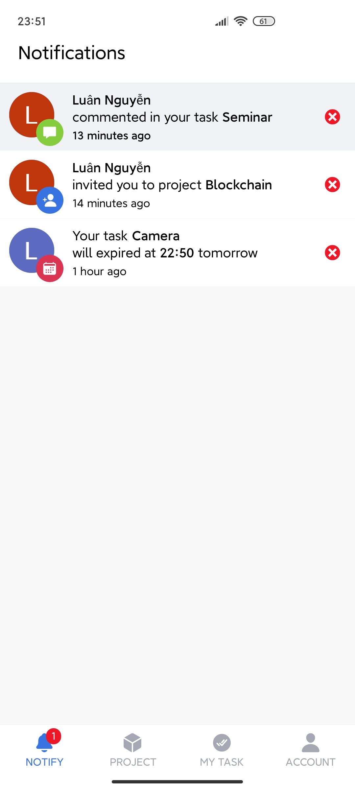 
</p>


## Yêu cầu thiết bị
- Android:
  + Gradle: 4.1
  + Min SDK: 21
  + Target SDK: 29
- iOS:
  + iOS: 11.0
## Thư viện và công nghệ
- Language: JavaScript
- Framework: React Native 0.64.0
- Database: Firebase Cloud Firestore
- react-native - https://github.com/facebook/react-native
- react-navigation - https://github.com/react-navigation/react-navigation
- react-native-firebase - https://github.com/invertase/react-native-firebase
- native-base - https://github.com/GeekyAnts/NativeBase
## Sơ đồ quan hệ
<p align="center">
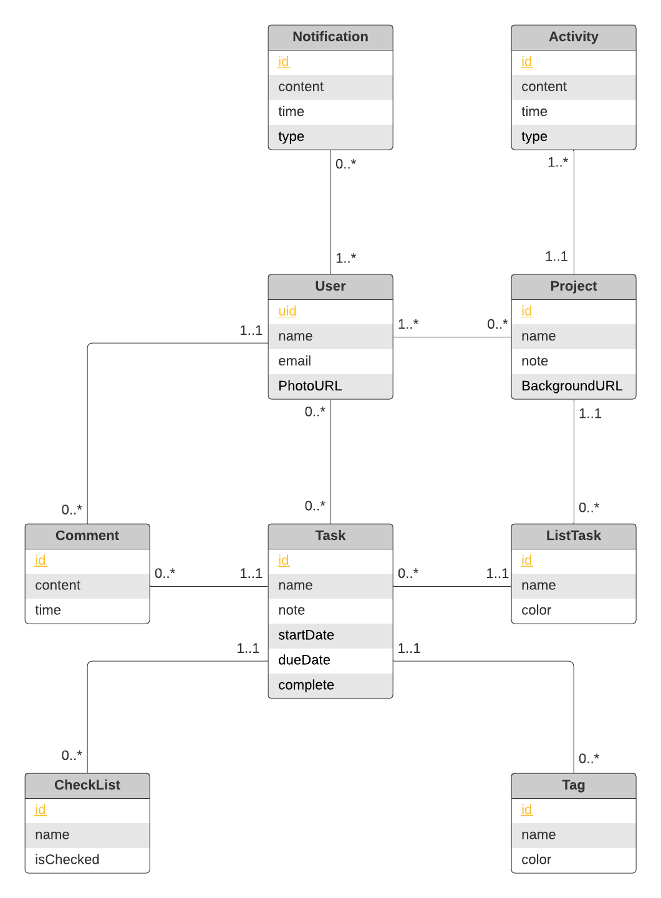
</p>

## Tác giả
- Nguyễn Xuân Luân - 18521066@gm.uit.edu.vn
- Phan Đức Cường - 18520547@gm.uit.edu.vn
- Trương Nhật Tiến - 18521494@gm.uit.edu.vn
## Giấy phép
```
Copyright 2014

Licensed under the Apache License, Version 2.0 (the "License");
you may not use this file except in compliance with the License.
You may obtain a copy of the License at

   http://www.apache.org/licenses/LICENSE-2.0

Unless required by applicable law or agreed to in writing, software
distributed under the License is distributed on an "AS IS" BASIS,
WITHOUT WARRANTIES OR CONDITIONS OF ANY KIND, either express or implied.
See the License for the specific language governing permissions and
limitations under the License.
```
